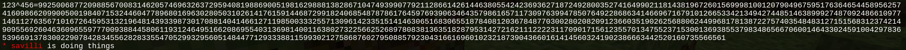

# minetestpyapi
A proxy mod for minetest mods written in python.

© savilli 2021

### How to run:
- `cd mods/minetestpyapi && ./api.py`
- start the minetest server

### How to write a mod:
Look for examples in `mods` folder.

